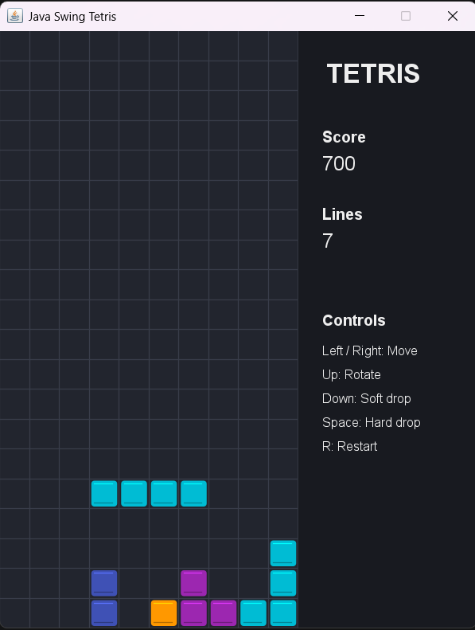

# Java Swing Tetris - 第一階段基礎版

這是一個使用 Java Swing 製作的基礎版 Tetris 遊戲，為期末專案第一階段提交版本。  
本階段目標是完成一個可以直接執行、可以實際遊玩的俄羅斯方塊遊戲，後續第二、第三階段繼續新增功能。

## 專案

- 使用 Java 標準函式庫 Swing 製作 GUI 視窗，不需要安裝額外套件。
- 標準 10 x 20 Tetris 棋盤。
- 包含七種基本方塊：I、O、T、S、Z、J、L。
- 支援方塊自動下落、左右移動、旋轉、加速下落與直接落下。
- 支援方塊落地固定、滿行消除、分數累計與消除行數統計。
- 支援遊戲結束判定與重新開始。

## 遊戲畫面與展示影片

### 🎮 實機演示 (Demo Video)
<!-- 這裡使用 HTML video 標籤實現直接播放 -->
<video src="src/video.mp4" width="100%" controls>
  您的瀏覽器不支援影片播放，請點擊下方連結觀看。
</video>

[若無法播放請點此下載/觀看影片](src/video.mp4)

### 📸 遊戲畫面 (Screenshot)


## 操作方式

| 按鍵 | 功能 |
| --- | --- |
| `←` | 方塊向左移動 |
| `→` | 方塊向右移動 |
| `↓` | 方塊加速下落 |
| `↑` | 方塊順時針旋轉 |
| `Space` | 方塊直接落到底 |
| `R` | 遊戲結束後重新開始 |

## 編譯與執行

請先確認電腦已安裝 JDK，並且可以使用 `javac` 與 `java` 指令。

### 1. 編譯

在專案根目錄執行：

```bash
javac -d out src/tetris/*.java
```

### 2. 執行

```bash
java -cp out tetris.TetrisApp
```

執行後會開啟遊戲視窗，使用鍵盤即可操作。

## 專案結構

```text
JAVA_final_project_tetris/
├── README.md
└── src/
    └── tetris/
        ├── GamePanel.java
        ├── GameState.java
        ├── Piece.java
        ├── Tetromino.java
        └── TetrisApp.java
```

### 主要類別說明

- `TetrisApp`：程式進入點，建立 Swing 視窗並啟動遊戲。
- `GamePanel`：負責畫面繪製、鍵盤控制與遊戲計時器。
- `GameState`：負責棋盤資料、碰撞判定、方塊固定、消行、分數與遊戲結束狀態。
- `Piece`：代表目前正在下落的方塊，包含位置、形狀與旋轉行為。
- `Tetromino`：定義七種 Tetris 方塊的初始形狀與顏色。

## 分數規則

| 消除行數 | 得分 |
| --- | --- |
| 1 行 | 100 |
| 2 行 | 300 |
| 3 行 | 500 |
| 4 行 | 800 |

使用 `Space` 直接落下時，每下降一格會額外增加 1 分。

## 第一階段完成內容

本階段已完成基礎 Tetris 遊戲核心：

- 遊戲視窗與棋盤顯示。
- 七種方塊隨機產生。
- 方塊移動、旋轉、下落與固定。
- 邊界與碰撞判定。
- 滿行消除。
- 分數與消除行數顯示。
- 遊戲結束與重新開始。

## 後續三階段規劃建議

### 第一階段：基礎可玩版本

目前版本即為第一階段，重點是完成 Tetris 的核心玩法，確認遊戲功能能正常運作。

### 第二階段：策略性與操作體驗強化

第二階段目標是讓遊戲不只是「能玩」，而是開始有策略選擇與挑戰節奏。玩家可以提前規劃下一步，也能透過速度、連擊與暫存方塊增加遊戲深度。

預計新增：

- 下一個方塊預覽：在側邊欄顯示下一個會出現的方塊，讓玩家可以提前安排空間。
- 幽靈方塊 Ghost Piece：用半透明方塊顯示目前方塊落到底的位置，降低操作失誤。
- 暫停與繼續功能：按 `P` 暫停或繼續，暫停時停止下落並顯示暫停畫面。
- 等級系統：每消除一定行數後升級，等級越高，方塊下落速度越快。
- Hold 暫存方塊：按 `C` 可以暫存目前方塊，之後再換回來，增加策略性。
- Combo 連續消行獎勵：連續多次成功消行時，給予額外分數，鼓勵玩家設計連續消除。
- 更完整的開始畫面與結束統計：顯示最後分數、消除行數、最高 Combo 與遊玩結果。

### 第三階段：挑戰模式與完整遊戲化

第三階段目標是把遊戲從單一模式提升成完整作品，加入不同玩法、長期目標與更有成就感的系統，讓玩家願意重複挑戰。

預計新增：

- 主選單與模式選擇：玩家可以選擇一般模式、限時模式或挑戰模式。
- 限時模式：例如 2 分鐘內挑戰最高分，適合短時間遊玩與展示。
- 垃圾行挑戰模式：遊戲過程中底部逐漸增加干擾行，玩家需要更快消除危機。
- 難度選擇：提供 Easy、Normal、Hard，不同難度影響初始速度與升級速度。
- 最高分紀錄：保存玩家最高分、最高消除行數與最高 Combo，增加重玩動機。
- 音效與背景音樂：加入消行、落地、旋轉、Game Over 等音效，提升遊戲回饋。
- UI 美化：加入更清楚的面板、按鈕、色彩主題與遊戲結束統計畫面。
