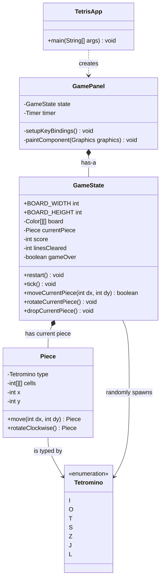
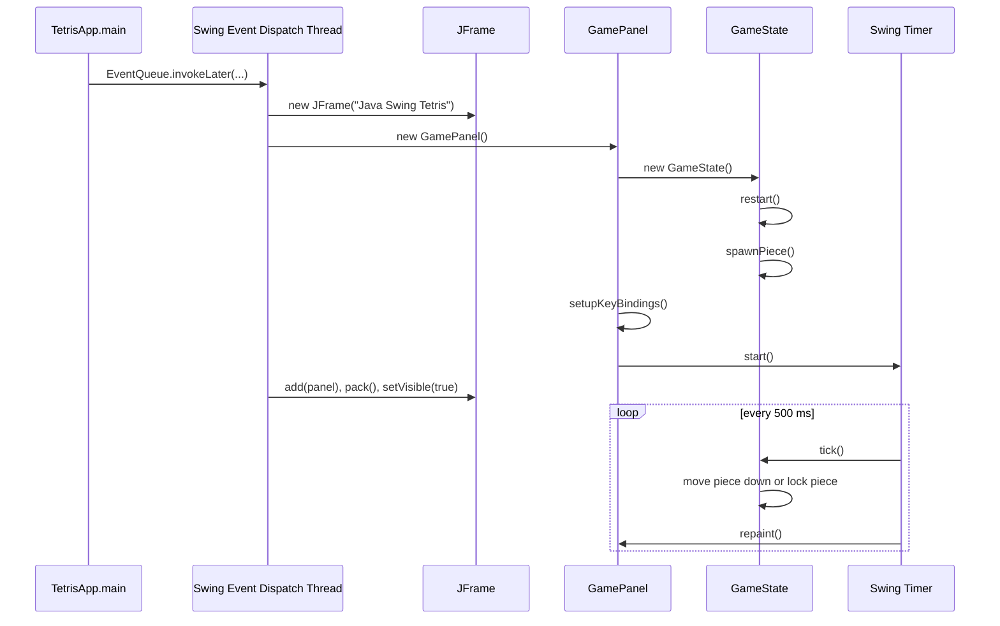

# Tetris Architecture

本文件說明第一階段 Tetris 專案的主要類別、關係與啟動流程，方便在 pull request review 時快速理解目前設計。

這份文件會隨著第二階段與第三階段持續增修。每次新增重要玩法、類別或流程時，應同步更新 UML 與文字說明，讓 reviewer 可以從同一份文件追蹤架構演進。

## Class Overview

## Relationship Notes

- `TetrisApp` 是程式進入點，只負責建立 Swing 視窗並放入 `GamePanel`。
- `GamePanel` has-a `GameState`，負責畫面、鍵盤輸入與 Swing `Timer`。
- `GameState` has-a `Piece`，負責目前方塊、棋盤、分數、消行與遊戲結束狀態。
- `Piece` has-a `Tetromino`，方塊本身保存目前位置與旋轉後的格子座標。
- `Tetromino` 是 enum，不是父類別；目前專案沒有 class inheritance 的 is-a 關係。

## Startup Flow

## First-Phase Design Boundary

第一階段的目標是可執行、可遊玩、核心規則完整。因此目前先保持簡單：

- 不引入外部套件。
- 不拆出複雜 MVC 架構。
- 不加入音效、選單、存檔或多模式。
- 優先讓同學可以讀懂主流程，再於第二、第三階段逐步重構或擴充。

## Update Policy

後續 PR 若新增或調整核心設計，建議一起更新本文件：

- 新增 class：補到 class diagram，並說明它和既有 class 的 has-a 或 dependency 關係。
- 新增遊戲流程：補到 startup flow 或新增 sequence diagram。
- 改變職責分工：更新 relationship notes，避免文件和程式碼逐漸不同步。
- 第二、第三階段若導入新功能，例如 next piece、hold、level、menu、score storage，應在 PR 中說明 UML 是否需要更新。
